# Transações em Bancos de Dados

## Conceito Básico
Uma transação é um mecanismo que descreve uma unidade lógica de processamento em bancos de dados, onde:
- **Todas** as operações são executadas com sucesso (atomicidade)
- **Nenhuma** operação é executada em caso de falha

## Características Principais
1. **Atomicidade (ACID)**: A transação é indivisível - ou executa completamente ou não executa nada
2. **Ambiente Multi-usuário**: SGBDs geralmente atendem múltiplos usuários simultaneamente
3. **Base em Redundância**: Permite reconstituir informações a partir de outros dados armazenados

## Implementação
- Pode ser declarada de forma **implícita** (cada comando SQL como uma transação) ou **explícita**
- Em SQL, os limites são definidos por:
  ```sql
  BEGIN TRANSACTION
    -- operações SQL
  COMMIT -- ou ROLLBACK
  ```

## Controle de Concorrência
Necessário para gerenciar o acesso simultâneo de múltiplas transações aos mesmos dados, garantindo:
- Isolamento entre transações
- Consistência dos dados

## Mecanismo de Recuperação
Fundamental para tratar falhas durante a execução de transações, permitindo:
- Retornar ao estado consistente anterior (rollback)
- Garantir a durabilidade das transações confirmadas

## Operações
De forma abstrata, uma transação consiste em um conjunto de operações de:
- **Leitura** (recuperação de dados)
- **Escrita** (modificação de dados)

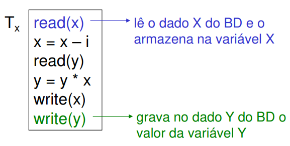

## Estrutura Básica de uma Transação
Uma transação consiste em uma sequência de operações sobre o banco de dados:
- **Inclusão** (INSERT)
- **Exclusão** (DELETE)
- **Modificação** (UPDATE)
- **Recuperação** (SELECT)

## Delimitação de Transações
Os limites são definidos explicitamente com:
```sql
BEGIN TRANSACTION
  -- Operações SQL aqui
END TRANSACTION
```
(Nota: Na prática, muitos SGBDs usam `COMMIT` ou `ROLLBACK` no lugar de `END TRANSACTION`)

## Características Importantes
1. **Múltiplas transações por programa**: Um único programa pode conter várias transações distintas
2. **Granularidade**: Refere-se ao tamanho do item de dado envolvido, que pode ser:
   - Um registro individual
   - Um bloco completo de disco

## Operações Fundamentais

### Operação READ(x)
1. Localiza o bloco de disco onde x está armazenado
2. Copia o bloco do disco para o buffer na memória principal
3. Copia o item x específico do buffer para a variável do programa

### Operação WRITE(x)
1. Localiza o bloco de disco onde x está armazenado
2. Copia o bloco do disco para o buffer na memória principal
3. Copia o valor de x da variável do programa para o buffer
4. Grava o bloco atualizado do buffer de volta para o disco:
   - Imediatamente (write-through)
   - Ou posteriormente (write-back, mais comum)

## Fluxo de Dados
```
[Disco] ↔ [Buffer na Memória] ↔ [Variáveis do Programa]
```
As operações READ e WRITE fazem a mediação entre estes níveis de armazenamento.

## Considerações de Desempenho
- A granularidade afeta diretamente o desempenho (blocos maiores podem ser mais eficientes para certas operações)
- O momento da gravação em disco (imediatamente ou não) afeta a durabilidade e o desempenho
- O gerenciamento de buffers é crucial para a eficiência do sistema

# Gerenciamento de Transações: Controle de Concorrência e Recuperação

## Visão Geral do Gerenciamento
O gerenciamento de transações envolve dois componentes essenciais:

1. **Controle de Concorrência**: Coordena o acesso paralelo a dados compartilhados
2. **Recuperação**: Garante a integridade dos dados frente a falhas de hardware/software

## Controle de Concorrência

### Necessidade do Controle
- Transações executam concorrentemente para melhorar desempenho
- Quando múltiplas transações acessam o mesmo item de dados com operações entrelaçadas, surgem problemas que exigem controle

### Problemas Típicos sem Controle

1. **Perda de Atualização (Lost Update)**
   - Ocorre quando duas transações leem o mesmo dado e o atualizam
   - A segunda transação sobrescreve a atualização da primeira
   - Exemplo: Duas transações incrementando o mesmo saldo bancário

2. **Dependência de Atualização Não Confirmada (Dirty Read)**
   - Uma transação lê dados modificados por outra transação não confirmada
   - Se a segunda transação fizer rollback, a primeira estará baseada em dados inválidos

3. **Função de Agregação Incorreta (Incorrect Summary)**
   - Ocorre quando uma transação de leitura calcula agregados (somas, médias) enquanto outra transação atualiza os dados
   - Resulta em valores inconsistentes (ex: saldo total calculado durante transferências)

## Mecanismos de Controle

### Técnicas Comuns
- **Bloqueios (Locks)**: Transações adquirem locks antes de acessar dados
- **Timestamping**: Cada transação recebe um timestamp para ordenar operações
- **Controle Multiversão**: Mantém versões anteriores dos dados para leituras consistentes

### Níveis de Isolamento
Os SGBDs oferecem diferentes níveis de isolamento para balancear consistência e desempenho:
1. Read Uncommitted (nenhum controle)
2. Read Committed (evita dirty reads)
3. Repeatable Read (evita dirty reads e non-repeatable reads)
4. Serializable (isolamento completo)

## Mecanismos de Recuperação

### Objetivos
- Garantir atomicidade (transações completas ou nenhum efeito)
- Assegurar durabilidade (transações confirmadas persistem)

### Técnicas Principais
1. **Log de Transações**: Registra todas as operações para permitir redo/undo
2. **Checkpoints**: Pontos de sincronização que reduzem tempo de recuperação
3. **Shadow Paging**: Mantém versões alternativas dos dados

A combinação desses mecanismos permite que o SGBD mantenha a consistência dos dados mesmo em ambientes com alta concorrência e sujeitos a falhas.

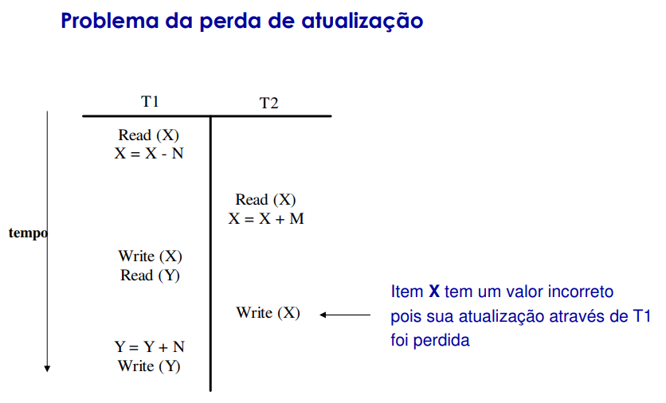

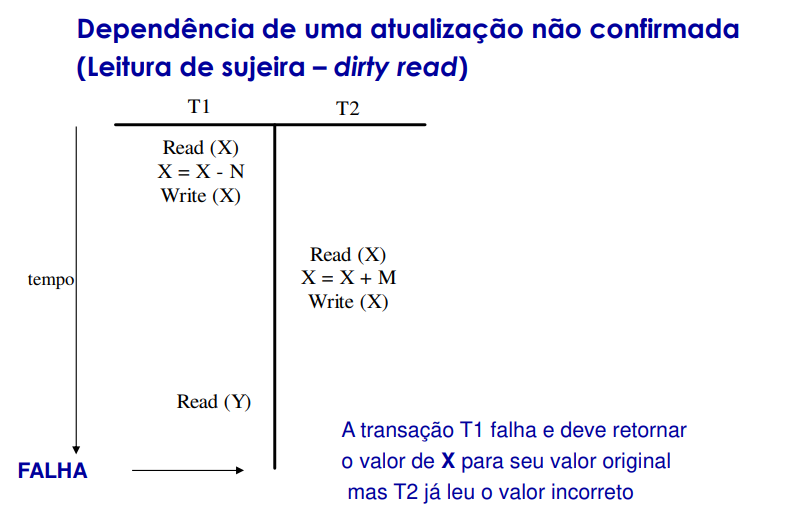

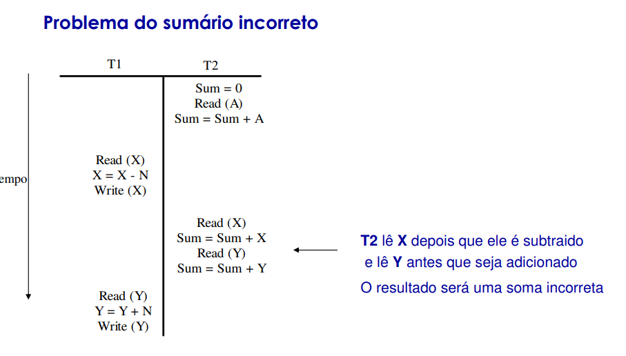

# Estados e Ciclo de Vida de Transações em SGBDs

## Comandos Fundamentais de Controle

1. **BEGIN TRANSACTION**:
   - Inicia explicitamente uma nova transação
   - Marca o ponto inicial para possível rollback

2. **COMMIT TRANSACTION**:
   - Finaliza com sucesso a transação
   - Torna permanentes todas as alterações
   - Libera recursos alocados

3. **ROLLBACK TRANSACTION**:
   - Aborta a transação devido a erros
   - Desfaz todas as alterações desde o BEGIN
   - Retorna o banco ao estado anterior

## Mecanismos de Recuperação

### Princípios Básicos:
- **Sucesso total**: Todas operações completadas → alterações permanentes
- **Falha parcial**: Qualquer operação falha → nenhum efeito no banco (atomicidade)

### Tipos de Falhas:
- **Hardware**: Quedas de energia, falhas de disco
- **Software**: Erros no SGBD ou aplicação
- **Rede**: Conexões interrompidas
- **Sistema**: Panes no sistema operacional
- **Transação**: Violação de restrições de integridade
- **Exceções**: Condições não previstas detectadas

## Ciclo de Vida e Estados das Transações

### Grafo de Transição de Estados:

```
[Ativa] → [Em Processo de Efetivação] → [Efetivada] → [Concluída]
    ↓             ↓
[Falha Detectada] → [Em Processo de Aborto] → [Abortada]
```

### Descrição dos Estados:

1. **Ativa**:
   - Estado inicial após BEGIN TRANSACTION
   - Operações sendo executadas normalmente

2. **Em Processo de Efetivação (Committing)**:
   - Após COMMIT ser chamado
   - SGBD preparando para tornar alterações permanentes

3. **Efetivada (Committed)**:
   - Alterações já persistidas
   - Ponto de não-retorno (não pode mais desfazer)

4. **Em Processo de Aborto (Aborting)**:
   - Após falha ou ROLLBACK
   - SGBD desfazendo alterações

5. **Concluída (Terminated)**:
   - Estado final bem-sucedido
   - Recursos liberados

6. **Abortada (Failed)**:
   - Estado final após rollback completo
   - Sistema retornou ao estado consistente anterior

## Monitoramento pelo SGBD

O Sistema Gerenciador monitora constantemente:
- Quais operações já foram executadas
- Se todas operações foram concluídas
- Se deve abortar devido a erros
- O estado atual no grafo de transição

Esses mecanismos garantem as propriedades ACID (Atomicidade, Consistência, Isolamento e Durabilidade) mesmo em ambientes com falhas e concorrência.

## Transição de Estados de uma Transação

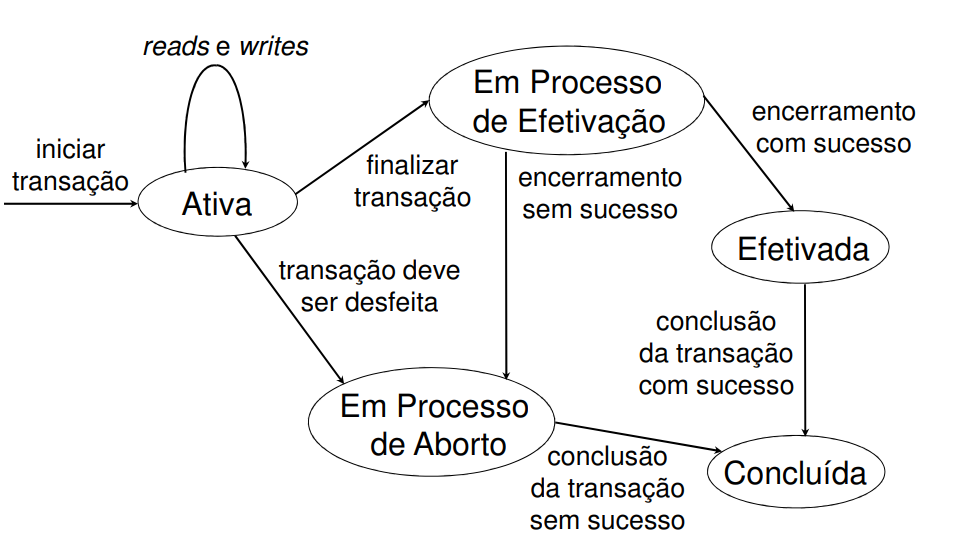

- Ativa: estado inicial de toda ser desfeita transação selecionada para execução. Enquanto ativa, uma transação executa uma ou mais operações read e write.
- Em Processo de Efetivação: entra nesse estado após executar sua última operação
(solicitação de COMMIT). Neste momento, o SGBD precisa garantir que as suas atualizações sejam efetivadas com sucesso (não sofra falhas). Aplicação de técnicas de recovery.
- Efetivada:  entra nesse estado após o SGBD confirmar que todas as modificações da transação estão garantidas no BD (COMMIT OK). Exemplos: gravação em Log, descarga de todos os buffers em disco.
- Em Processo de Aborto: entra nesse estado se não puder prosseguir a sua execução. Pode passar para esse estado enquanto ativa (I) ou em processo de efetivação (II). Exemplo (I): violação de RI. Exemplo (II): pane no S.O. suas ações já realizadas devem ser desfeitas (ROLLBACK).
- Concluída: estado final de uma transação • indica uma transação que deixa o sistema. As informações da transação mantidas em catálogo podem ser excluídas operações feitas, dados manipulados, buffers utilizados, ... se a transação não concluiu com sucesso, ela pode ser reiniciada automaticamente.

# Propriedades ACID das Transações em Bancos de Dados

As transações em SGBDs devem garantir quatro propriedades fundamentais conhecidas como ACID:

## 1. Atomicidade (Atomicity)

**Princípio do "Tudo ou Nada":**
- Todas as operações da transação são completadas com sucesso **ou**
- Nenhuma das operações tem efeito no banco de dados

**Mecanismos de Implementação:**
- Gerenciada pelo subsistema de recuperação (recovery)
- Utiliza técnicas como:
  - Log de transações (undo/redo)
  - Checkpoints
  - Shadow paging

**Exemplo Prático:**
- Em uma transferência bancária, ambas as operações (débito em uma conta e crédito em outra) devem ser completadas ou nenhuma deve ocorrer

## 2. Consistência (Consistency)

**Princípio Fundamental:**
- Toda transação leva o banco de dados de um estado consistente para outro estado consistente
- Preserva todas as regras de integridade definidas

**Responsabilidades Compartilhadas:**
- **DBA** deve definir:
  - Restrições de integridade (chaves, domínios)
  - Triggers e regras de negócio
  - Exemplos: Saldo ≥ 0, FK válidas, datas consistentes
- **SGBD** deve:
  - Verificar restrições antes do commit
  - Abortar transações que violam consistência

**Níveis de Consistência:**
- Consistência declarativa (restrições explícitas)
- Consistência procedural (regras implementadas em código)

## 3. Isolamento (Isolation)

**Princípio de Execução Isolada:**
- Transações concorrentes devem se comportar como se executassem sequencialmente
- Efeitos intermediários não devem ser visíveis a outras transações

**Problemas Evitados:**
- Leitura suja (dirty reads)
- Leitura não repetível (non-repeatable reads)
- Leitura fantasma (phantom reads)

**Mecanismos de Implementação:**
- Gerenciado pelo escalonador (scheduler) do SGBD
- Técnicas comuns:
  - Bloqueios (locks) em vários níveis
  - Controle de concorrência multiversão (MVCC)
  - Timestamp ordering

**Níveis de Isolamento (ANSI SQL):**
1. Read Uncommitted (nenhum isolamento)
2. Read Committed (evita dirty reads)
3. Repeatable Read (evita dirty e non-repeatable reads)
4. Serializable (isolamento total)

## 4. Durabilidade (Durability)

**Princípio da Persistência:**
- Uma vez confirmada (committed), as alterações de uma transação permanecem no BD mesmo após falhas

**Mecanismos de Garantia:**
- Write-ahead logging (WAL)
- Armazenamento em mídia não volátil
- Replicação em alguns casos

**Técnicas de Implementação:**
- Logs de transações armazenados em disco
- Sincronização periódica (checkpoints)
- Algoritmos de recovery após falhas

## Interdependência das Propriedades

As propriedades ACID trabalham em conjunto:
- **Atomicidade + Durabilidade**: Garantem que transações completas persistem e incompletas não deixam rastro
- **Consistência + Isolamento**: Garantem que o banco sempre reflete um estado válido, mesmo com concorrência
- O sistema de logs serve tanto para recovery (atomicidade/durabilidade) quanto para consistência

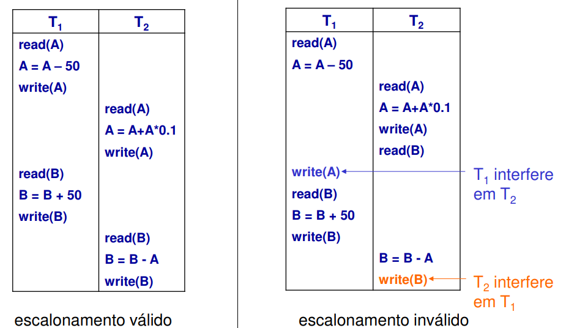

# Durabilidade e Mecanismos de Recuperação em Transações

## Durabilidade (Persistência)

### Princípio Fundamental
- **Garantia absoluta**: Modificações de transações confirmadas (committed) devem persistir permanentemente
- **Resistência a falhas**: Sobrevive a quedas de hardware, software ou energia

### Responsabilidades do SGBD
1. **Subsistema de Recovery**:
   - Implementa protocolos de write-ahead logging (WAL)
   - Garante que logs estejam em disco antes das alterações

2. **Estratégias de Garantia**:
   - **Sincronização imediata**: Força escrita em disco no commit
   - **Replicação**: Manter cópias redundantes dos dados
   - **Armazenamento estável**: Logs em mídia não volátil

## Log de Transações

### Estrutura Básica do Log
Registros contendo informações críticas para recuperação:

1. **[start_transaction, T]**: Início da transação T
2. **[write_item, T, X, old_value, new_value]**: 
   - Alteração do item X (valor antigo e novo)
   - Permite undo (com old_value) e redo (com new_value)
3. **[read_item, T, X]**: Leitura do item X pela transação T
4. **[commit, T]**: Confirmação bem-sucedida da transação T
5. **[abort, T]**: Aborto explícito da transação T

### Características do Log
- **Armazenamento primário**: Mantido em disco para persistência
- **Backup periódico**: Copiado para mídias externas (fitas, armazenamento remoto)
- **Estrutura circular**: Pode ser reaproveitado após checkpoints

## Processos de Recuperação

### Operações Baseadas no Log
1. **UNDO (Desfazer)**:
   - Aplicado a transações não confirmadas (abortadas)
   - Reverte alterações usando old_value dos registros write_item

2. **REDO (Refazer)**:
   - Aplicado a transações confirmadas mas não persistidas
   - Reaplica alterações usando new_value

### Protocolos de Recuperação
1. **Write-Ahead Logging (WAL)**:
   - Regra 1: Todos logs devem estar em disco antes das alterações correspondentes
   - Regra 2: Todos logs de commit devem estar em disco antes do commit ser considerado completo

2. **Checkpointing**:
   - Pontos de sincronização onde:
     - Buffers são escritos em disco
     - Logs são consolidados
     - Informação de checkpoint é registrada

## Exemplo de Fluxo de Recuperação

1. **Após falha**:
   - Identificar transações ativas no momento da falha
   - Analisar log desde último checkpoint

2. **Fase UNDO**:
   ```python
   for each [start_transaction,T] without [commit,T] or [abort,T]:
       for each [write_item,T,X,old_value,_] in reverse order:
           restore X = old_value
       add [abort,T] to log
   ```

3. **Fase REDO**:
   ```python
   for each [write_item,T,X,_,new_value] where [commit,T] exists:
       if X not yet persisted:
           update X = new_value
   ```

4. **Finalização**:
   - Garantir que todos metadados estão consistentes
   - Registrar conclusão do processo de recovery

## Vantagens do Mecanismo de Log
- **Baixo overhead**: Operações de log são sequenciais e rápidas
- **Recuperação precisa**: Permite restaurar até o último estado válido
- **Flexibilidade**: Suporta diferentes estratégias de persistência
- **Controle granular**: Permite recuperação parcial se necessário

# Estratégias de Modificação de Dados e Checkpoints em SGBDs

## Técnicas de Modificação no Banco de Dados

### 1. Modificações Adiadas (Deferred Update)
**Princípio de Funcionamento:**
- Alterações são mantidas em buffers de memória
- O banco físico só é atualizado **após** o commit
- Usa abordagem **no-steal** (não escreve antes do commit)

**Vantagens:**
- Elimina necessidade de UNDO (nada foi escrito no BD)
- Simplifica recuperação (apenas REDO para transações commitadas)

**Desvantagens:**
- Requer mais memória principal
- Commit mais lento (deve escrever tudo no disco de uma vez)

### 2. Modificações Imediatas (Immediate Update)
**Princípio de Funcionamento:**
- Alterações podem ser escritas no BD **antes** do commit
- Usa abordagem **steal** (permite escrita antes do commit)
- Exige log completo para possibilitar UNDO

**Vantagens:**
- Menor consumo de memória
- Mais eficiente para transações longas

**Desvantagens:**
- Recuperação mais complexa (requer UNDO e REDO)
- Overhead maior de logging

**Garantias Necessárias:**
- Protocolo Write-Ahead Logging (WAL) obrigatório
- Log deve estar em disco antes da alteração correspondente no BD

## Checkpoints: Mecanismo de Otimização

### Processo de Checkpoint
1. **Suspensão temporária** de todas as transações ativas
2. **Gravação forçada** de todos os buffers modificados para disco
3. **Registro do checkpoint** no log
4. **Retomada** das transações suspensas

### Benefícios Principais:
- **Redução do tempo de recuperação**: Limita a análise do log ao período desde o último checkpoint
- **Otimização de recursos**: Transações commitadas antes do checkpoint não precisam de REDO
- **Consolidação de alterações**: Minimiza trabalho pendente de persistência

### Políticas de Agendamento:
| Critério        | Vantagens                          | Desvantagens                  |
|-----------------|------------------------------------|--------------------------------|
| **Temporal**    | Previsível, regular               | Pode ser ineficiente           |
| **Nº Transações** | Adapta-se à carga                 | Irregular                      |
| **Híbrido**     | Balanceado                        | Complexidade de implementação  |

### Impacto na Recuperação:
1. **Transações commitadas antes do checkpoint**:
   - Já estão persistidas no BD
   - Não requerem REDO

2. **Transações commitadas após o checkpoint**:
   - Exigem REDO a partir do ponto no log onde começaram

3. **Transações ativas no momento do checkpoint**:
   - Precisam de UNDO para operações não commitadas

## Exemplo de Registro de Checkpoint no Log

```
[checkpoint_start]
[start_transaction, T1]
[write_item, T1, X, 100, 150]
[commit, T1]
[start_transaction, T2]
[write_item, T2, Y, 200, 250]
[checkpoint_end]
[start_transaction, T3]
...
```

## Boas Práticas de Configuração
1. **Frequência de checkpoints**:
   - Muito frequente: Overhead excessivo
   - Muito raro: Tempo de recuperação longo

2. **Monitoramento**:
   - Ajustar dinamicamente baseado em:
     - Volume de transações
     - Tempo médio entre falhas
     - Requisitos de disponibilidade

3. **Balanceamento**:
   - Ideal: Checkpoint quando 70-80% do log estiver ocupado
   - Alternativa: A cada N minutos ou M transações

# Controle de Concorrência em Bancos de Dados: Técnicas e Mecanismos

## O Problema Fundamental

Em sistemas de banco de dados multiusuário, o controle de concorrência resolve a tensão entre dois requisitos críticos:
1. **Isolamento**: Cada transação deve se comportar como se estivesse executando sozinha
2. **Desempenho**: Maximizar a utilização de recursos através do paralelismo

## Soluções e Evolução

### 1. Abordagem Serial (Ingênua)
- **Implementação**: Execução estritamente sequencial
- **Problemas**:
  - **Subutilização de CPU**: Ociosidade durante operações de I/O
  - **Alta latência**: Transações ficam em fila de espera
  - **Throughput limitado**: Baixo número de transações por unidade de tempo

### 2. Abordagem Concorrente (Solução Ideal)
- **Princípio**: Execução paralela que **preserva a serializabilidade**
- **Componente-chave**: *Scheduler* (agendador de transações)

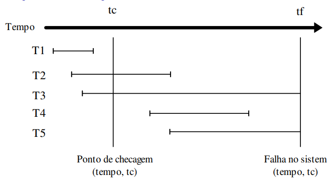


## O Scheduler de Transações

### Responsabilidades Principais:
1. **Gerar escalonamentos serializáveis**:
   - Equivalência de conflito (conflict serializability)
   - Equivalência de visão (view serializability)

2. **Implementar protocolos de controle**:
   - **Lock-based**: 2PL (Two-Phase Locking), hierárquico
   - **Timestamp-based**: Ordenação temporal
   - **Otimista**: Validação pós-execução
   - **Multiversão (MVCC)**: Snapshots consistentes

3. **Gerenciar conflitos**:
   - Deadlock detection & resolution
   - Wait-for graphs
   - Algoritmos de prevenção (wait-die, wound-wait)

## Protocolos de Controle

### Two-Phase Locking (2PL) - Clássico
- **Fase 1 (Expansão)**: Apenas adquirir locks
- **Fase 2 (Contração)**: Apenas liberar locks
- **Variações**:
  - Rigorous 2PL: Locks liberados apenas no commit
  - Conservative 2PL: Adquire todos locks no início

### Controle Multiversão (MVCC)
- **Vantagem**: Leituras não bloqueiam escritas
- **Mecanismo**:
  - Mantém histórico de versões
  - Transações leem snapshots consistentes
  - Resolução de conflitos no commit

## Exemplo Prático: Problemas de Concorrência

**Cenário**:
- T1: Transação de saque (lê saldo X, subtrai 100, escreve X')
- T2: Transação de depósito (lê saldo X, soma 200, escreve X'')

**Problemas sem controle**:
1. **Lost Update**: Se executam em paralelo, uma sobrescreve a outra
2. **Dirty Read**: T2 lê X' não commitado de T1, que depois faz rollback
3. **Inconsistent Retrieval**: Consulta vê saldo parcialmente atualizado

**Solução com 2PL**:
```sql
-- T1
BEGIN;
SELECT saldo FROM conta WHERE id=1 FOR UPDATE; -- Lock exclusivo
UPDATE conta SET saldo = saldo - 100 WHERE id=1;
COMMIT;

-- T2
BEGIN;
SELECT saldo FROM conta WHERE id=1 FOR UPDATE; -- Espera lock
UPDATE conta SET saldo = saldo + 200 WHERE id=1;
COMMIT;
```

## Métricas de Desempenho

| Métrica               | Impacto do Controle de Concorrência       |
|-----------------------|------------------------------------------|
| Throughput            | Pode reduzir com bloqueios excessivos    |
| Latência              | Aumenta com espera por locks             |
| Taxa de abortos       | Depende da política de conflitos         |
| Utilização de recursos| Melhor que abordagem serial              |

## Técnicas Avançadas

1. **Níveis de Isolamento Configuráveis**:
   - Read Uncommitted → Serializable
   - Trade-off entre consistência e desempenho

2. **Detecção de Deadlocks**:
   - Timeouts
   - Wait-for graphs
   - Prevenção (wait-die/wound-wait)

3. **Otimizações Específicas**:
   - Particionamento de dados
   - Escalonamento baseado em acesso
   - Lock escalation

Esta arquitetura sofisticada permite que SGBDs modernos como PostgreSQL, Oracle e SQL Server mantenham consistência ACID enquanto suportam milhares de transações concorrentes. O segredo está no balanceamento inteligente entre paralelismo e controle, adaptando-se dinamicamente à carga de trabalho.

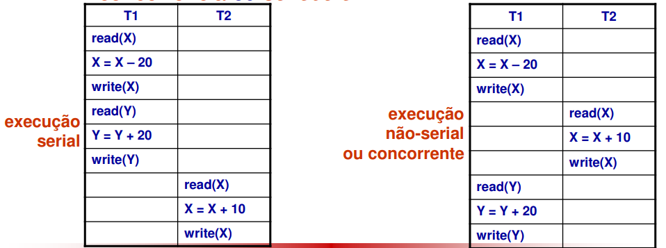


# O Scheduler em Sistemas de Banco de Dados: Garantindo Escalonamentos Válidos

## Papel Central do Scheduler

O scheduler é o componente do SGBD responsável por ordenar as operações concorrentes de múltiplas transações, criando um **escalonamento (schedule)** que:

1. Preserva a ordem original das operações dentro de cada transação individual
2. Mantém a **ilusão de serialização** (como se executassem sequencialmente)
3. Maximiza o paralelismo para melhor desempenho

## Definição Formal de Escalonamento

Um escalonamento **E** é uma ordenação das operações de um conjunto de transações onde:
- Para qualquer transação **Tₓ** em **E**
- A ordem das operações de **Tₓ** em **E** é idêntica à ordem em que aparecem em **Tₓ** isoladamente

## Problemas de Escalonamentos Mal Formados

### 1. Atualização Perdida (Lost Update)
**Cenário**:
- Duas transações leem o mesmo dado
- Ambas calculam novos valores baseados no valor lido
- Uma sobrescreve a atualização da outra

**Exemplo**:
```
T1: R(X) // Lê X=100
T2: R(X) // Lê X=100
T1: X = X+50; W(X) // Escreve X=150
T2: X = X*2; W(X) // Escreve X=200 (perde a atualização de T1)
```

### 2. Leitura Suja (Dirty Read)
**Cenário**:
- Uma transação lê dados modificados por outra transação não confirmada
- A transação original aborta, mas a segunda já usou dados inválidos

**Exemplo**:
```
T1: W(X, 200) // Modifica X (não confirmado)
T2: R(X) // Lê X=200 (valor "sujo")
T1: ABORT // Desfaz alteração
T2: Usa X=200 (valor incorreto)
```

## Como o Scheduler Previne Problemas

### Técnicas Principais:

1. **Protocolos de Bloqueio (Locking)**:
   - **Lock de Leitura (Shared)**: Múltiplas transações podem ler simultaneamente
   - **Lock de Escrita (Exclusive)**: Acesso exclusivo para escrita

2. **Two-Phase Locking (2PL)**:
   - **Fase de Expansão**: Transação só pode adquirir locks
   - **Fase de Contração**: Transação só pode liberar locks
   - Garante serializabilidade

3. **Ordenação por Timestamp**:
   - Cada transação recebe um timestamp único
   - Operações são validadas contra a ordem temporal

## Exemplo de Escalonamento Correto

**Transações**:
```
T1: R(X), W(X), C
T2: R(X), W(X), C
```

**Escalonamento Serializável**:
```
T1: R(X)
T1: W(X)
T1: C
T2: R(X)
T2: W(X)
T2: C
```

**Escalonamento Concorrente Válido** (equivalente ao serial acima):
```
T1: R(X)
T2: R(X)
T1: W(X)
T2: W(X) // Bloqueado até T1 commit
T1: C
T2: W(X) // Agora pode escrever
T2: C
```

## Implementação Prática

O scheduler moderno geralmente combina:

1. **MVCC (Multiversion Concurrency Control)**:
   - Mantém versões históricas dos dados
   - Leituras acessam snapshots consistentes

2. **Lock Management**:
   - Tabelas de locks em memória
   - Deadlock detection

3. **Otimizações**:
   - Predicate locking para phantom reads
   - Lock escalation para reduzir overhead

Esta arquitetura complexa permite que bancos de dados suportem milhares de transações concorrentes enquanto mantêm consistência ACID, resolvendo os problemas clássicos de concorrência como lost updates e dirty reads.


## Atualização Perdida

Uma transação Ty grava em um dado atualizado por uma transação Tx


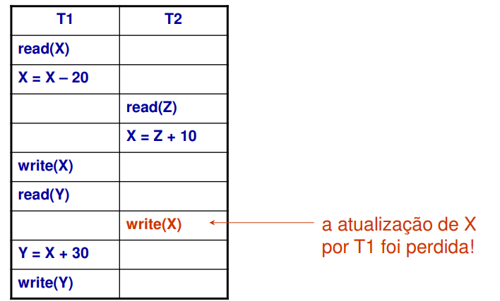

## Leitura Suja

Tx atualiza um dado X, outras transações posteriormente lêem X, e depois Tx falha

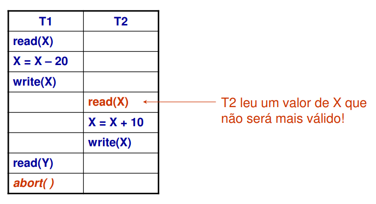

## Escalonamento Recuperável

- Garante que, se Tx realizou commit, Tx não irá sofrer UNDO
      * o recovery espera sempre esse tipo de escalonamento!
- Um escalonamento E é recuperável se nenhuma Tx em E for concluída até que todas as transações que gravaram dados lidos por Tx tenham sido concluídas

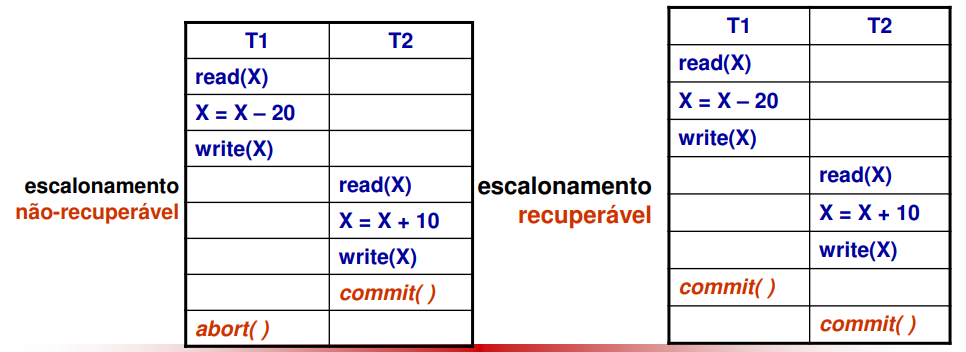


## Escalonamento sem Aborto em Cascata

- Um escalonamento recuperável pode gerar abortos de transações em cascata
      * consome muito tempo de recovery!
- Um escalonamento E é recuperável e evita aborto em cascata se uma Tx em E só puder ler dados que tenham sido atualizados por transações que já concluíram

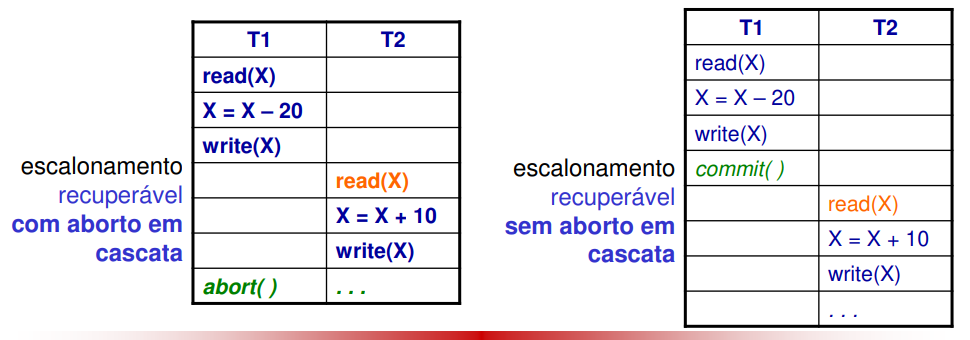

## Escalonamento Estrito

- Garante que, se Tx deve sofrer UNDO, basta gravar a before image dos dados atualizados por ela
- Um escalonamento E é recuperável, evita aborto em cascata e é estrito se uma Tx em E só puder ler ou
atualizar um dado X depois que todas as transações que atualizaram X tenham sido concluídas

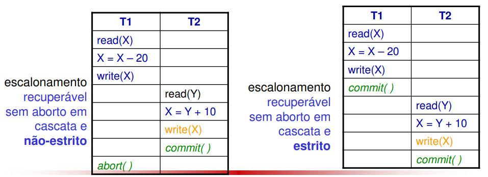

## Teoria da Serializabilidade

- Garantia de escalonamentos não-seriais válidos
- Premissa
      * “um escalonamento não-serial de um conjunto de transações deve produzir resultado equivalente a alguma execução serial destas transações”

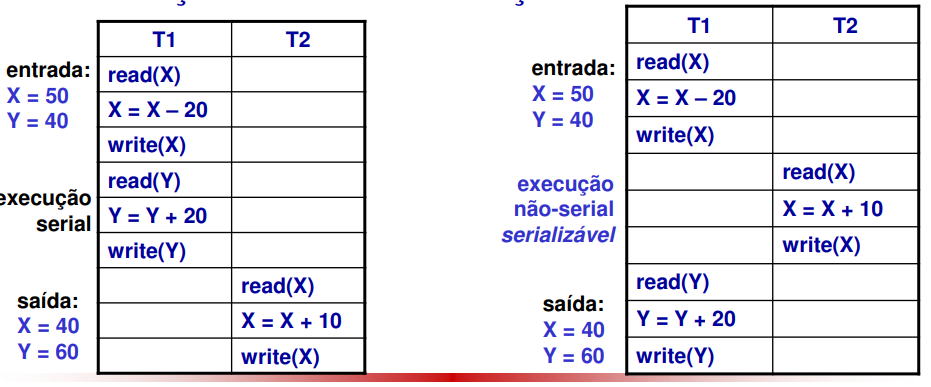


## Verificação de Serializabilidade


- Duas principais técnicas
      * equivalência de conflito
      * equivalência de visão
- Equivalência de Conflito
- “dado um escalonamento não-serial E’ para um conjunto de Transações T, E’ é serializável em conflito se E’ for equivalente em conflito a algum escalonamento serial E para T, ou seja, a ordem de quaisquer 2 operações em conflito é a mesma em E’ e E.”

### Equivalência de Conflito - Exemplo

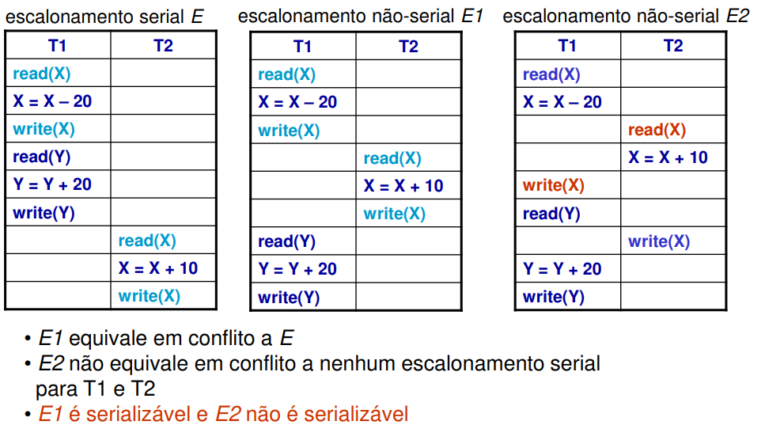

## Verificação de Equivalência em Conflito

- Construção de um grafo direcionado de precedência
      * nodos são IDs de transações
      * arestas rotuladas são definidas entre 2 transações T1 e
            T2 se existirem operações em conflito entre elas
            • direção indica a ordem de precedência da operação
            ** origem indica onde ocorre primeiro a operação
- Um grafo com ciclos indica um escalonamento nãoserializável em conflito!


Algoritmo para teste de serialidade de um plano S
1. Para cada transação Ti participante do Plano S, criar um nó rotulado Ti no grafo de precedência.
2. Para cada caso em S em que Tj executar um ler_item(X) depois que uma Ti executar um ecrever_item(X), criar uma seta (Ti → Tj ) no grafo de precedência.
3. Para cada caso em S em que Tj executar um escrever_item(X) depois que Ti executar um ler_item(X), criar uma seta (Ti → Tj ) no grafo de precedência.
4. Para cada caso em S em que Tj executar um escrever_item(X) depois que Ti executar um escrever_item(X), criar uma seta (Ti → Tj ) no grafo de precedência.
5. O plano S será serializável se, e apenas se, o grafo de precedência não contiver ciclos.

## Grafo de Precedência

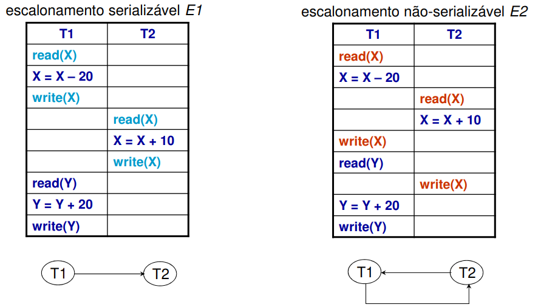

## Transações em SQL: Configuração e Controle

## Comportamento Padrão em SQL

Por padrão, todo comando SQL individual é tratado como uma transação autônoma:
- **Exemplo**: `DELETE FROM Pacientes` é uma transação completa
  - Ou exclui **todas** as tuplas consistentemente
  - Ou não exclui **nenhuma** (em caso de erro)
  - Mantém sempre a integridade do banco de dados

## Comandos de Controle de Transações (SQL-92)

### 1. `SET TRANSACTION`
Configura as propriedades da próxima transação:
```sql
SET TRANSACTION
    [mode] 
    [ISOLATION LEVEL level]
    [DIAGNOSTICS SIZE size];
```

### 2. `COMMIT [WORK]`
- Confirma todas as alterações da transação atual
- Torna as modificações permanentes no banco de dados

### 3. `ROLLBACK [WORK]`
- Desfaz todas as alterações da transação atual
- Retorna o banco ao estado anterior ao início da transação

## Principais Configurações de Transação

### Modos de Acesso:
| Modo          | Descrição                                      | Padrão |
|---------------|-----------------------------------------------|--------|
| READ ONLY     | Permite apenas operações de leitura           |        |
| READ WRITE    | Permite leitura e escrita (default)           | ✓      |
| WRITE ONLY    | Permite apenas operações de escrita (raro)    |        |

### Níveis de Isolamento:
| Nível              | Dirty Reads | Non-Repeatable Reads | Phantoms | Concorrência | Padrão |
|--------------------|-------------|-----------------------|----------|--------------|--------|
| SERIALIZABLE      | ❌          | ❌                   | ❌       | Baixa        | ✓      |
| REPEATABLE READ   | ❌          | ❌                   | ⚠️       | Média        |        |
| READ COMMITTED    | ❌          | ⚠️                   | ⚠️       | Alta         |        |
| READ UNCOMMITTED  | ⚠️          | ⚠️                   | ⚠️       | Máxima       |        |

## Exemplo Prático Completo

```sql
-- Configura transação para escrita com máximo isolamento
EXEC SQL SET TRANSACTION
    READ WRITE
    ISOLATION LEVEL SERIALIZABLE;

-- Início do bloco transacional
BEGIN
    LOOP
        -- Operações dentro da transação
        EXEC SQL INSERT INTO Empregados
        VALUES (:ID, :nome, :salario);
        
        EXEC SQL UPDATE Empregados
        SET salário = salário + 100.00
        WHERE ID = :cod_emp;
        
        -- Verificação de erro
        IF (SQLCA.SQLCODE <= 0) THEN
            EXEC SQL ROLLBACK; -- Aborta em caso de erro
            EXIT;
        END IF;
    END LOOP;
    
    -- Confirmação explícita
    EXEC SQL COMMIT;
END;
```

## Boas Práticas

1. **Defina explicitamente** transações para operações críticas
2. **Escolha o nível de isolamento** adequado ao seu caso:
   - `SERIALIZABLE` para operações financeiras críticas
   - `READ COMMITTED` para consultas gerais
3. **Sempre verifique erros** e implemente rollback quando necessário
4. **Mantenha transações curtas** para reduzir contenção
5. **Use READ ONLY** para transações de consulta pesada

Esta abordagem garante o balanceamento ideal entre consistência de dados e desempenho do sistema, adaptando-se a diferentes cenários operacionais.


